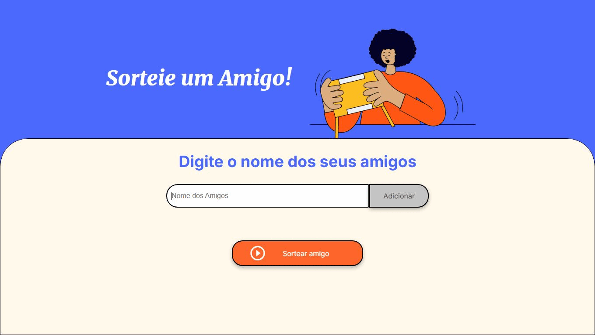

# Olá, sejam bem vindos ao jogo do amigo secreto!

## Para jogar o jogo é bem simples:

- Adicione seus amigos no campo "Nome dos Amigos".
- Em seguida, clique em "Sortear Amigo". 
- O amigo vencedor aparecerá no campo acima.
- Para jogar novamente, pressione F5.

**Esse desafio foi feito usando técnicas aprendidas no Oracle Next One.**

# Recursos utilizados:

          
          

